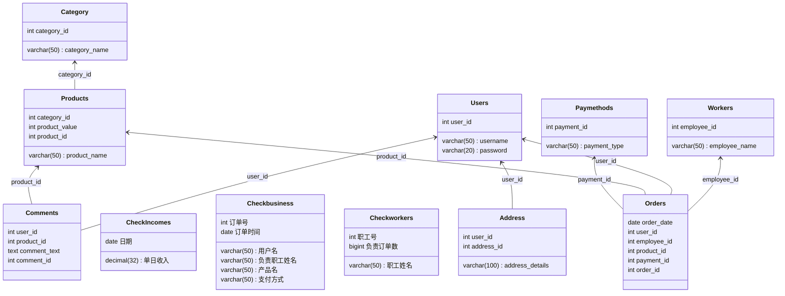

# 电商管理数据库

## 实体：
- 用户 (User)
- 订单 (Order)
- 产品 (Product)
- 支付方式 (PaymentMethod)
- 地址 (Address)
- 类别 (Category)
- 评论 (Comment)
- 员工 (Employee)

## 联系：
- 用户-地址 (一对一)
- 用户-订单 (一对多)
- 评论-用户 (多对一)
- 订单-产品 (一对多)
- 订单-支付方式 (多对一)
- 产品-类别 (多对多)
- 产品-评论 (一对多)
- 员工-订单 (一对多)

需要两个界面，一个是公司管理界面，另一个是用户界面

做出的功能是：

1. 公司管理界面内，可以管理员工信息，了解员工的订单信息，添加和减少员工分配的订单，修改员工的数量，并对每个员工的当前任务进行计数

2. 用户通过信息的录入（登录或者注册）来进行登录操作，可以查看自己的订单信息，可以增加或者减少自己的订单，更改自己的支付方式。

## 功能细化

### 公司管理界面

1. 通过专门的BOSS窗口登录，如果此时填写不正确会登陆失败，成功则进入老板模式。

2. 通过下拉窗口选择员工，选择员工的订单进行查看

### 用户管理系统

1. 用户可以进行注册，增加自己账户，注销个人账户，修改个人账户，查看账户信息。

2. 用户可以查询自己的订单（连接查询），增加或者取消订单

3. 用户可以修改订单的信息，包括产品的名称以及地址信息,以及相关产品的评论内容

4. 用户可以查看不同的产品，每个产品有不同的类别，每个类别也有不同的产品

5. 用户可以查看负责订单的员工的信息

